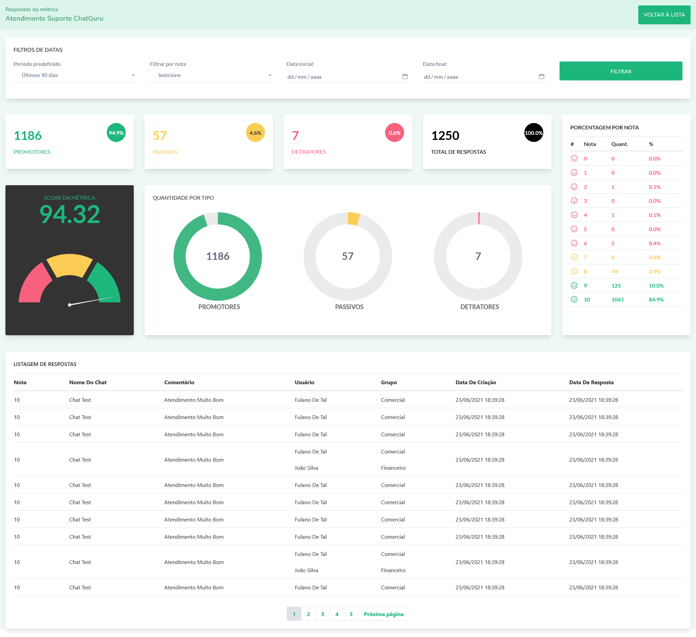
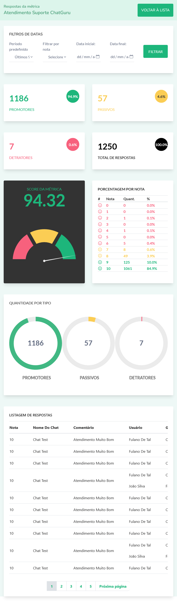

<h1 align="center">Teste 02 | Página em Vue</h1>

<div align="center">

&nbsp;
&nbsp;
&nbsp;
&nbsp;
&nbsp;
</div>

### Project Setup

```sh
npm install
```

#### Run json-server
```sh
json-server --watch database/nps-database.json
```

#### Compile and Hot-Reload for Development

```sh
npm run dev
```

#### Compile and Minify for Production

```sh
npm run build
```

#### Run Unit Tests with [Vitest](https://vitest.dev/)

```sh
npm run test:unit
```

#### Lint with [ESLint](https://eslint.org/)

```sh
npm run lint
```

### Links
<a href="https://github.com/natalia-sampaio"></a>
<a href=""></a>

### Objective


### Result




